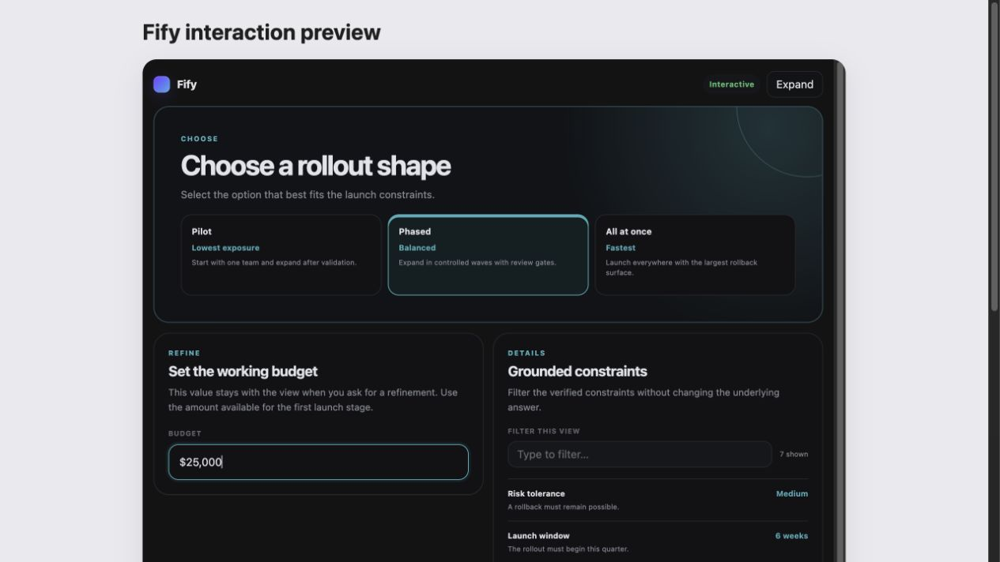

# Fify

**AI that speaks interface.**

Fify turns grounded AI answers into trusted, interactive information views: comparisons, timelines, plans, checklists, profiles, decision tools, and other layouts that are easier to scan and use than a wall of text.

The model never writes HTML, React, CSS, JavaScript, or executable UI code. It produces a small semantic plan that Fify validates, translates to A2UI, and renders through application-owned components. The original answer remains available as a plain-language fallback.

## Why Fify

AI usually communicates through prose even when the user needs structure, comparison, chronology, progress, or interaction. Fify adds a controlled UX compilation layer:

```text
prompt + trusted information
  → semantic UX decision
  → validated information graph
  → progressive A2UI stream
  → product-owned components
```

This gives teams adaptive information design without accepting model-authored executable code or surrendering their design system.



## Two ways to use it

### Browser application

```bash
corepack enable
pnpm install
pnpm web
```

Open <http://localhost:3000>. Add your OpenAI API key from **Settings** in the lower-left navigation, then ask normally. The browser key is kept in session storage and sent only with generation requests. A server operator can instead configure `OPENAI_API_KEY`.

### ChatGPT or Codex host integration

Fify includes an MCP Apps server and portable widget in `apps/mcp-app`. To build the local Codex plugin:

```bash
corepack enable
pnpm install
pnpm codex:install
```

This path requires Node.js 22+, pnpm 11+, and a Codex installation with plugin commands. Then start a new Codex task and ask normally, or tag `@Fify` when an interactive information view would help. The deterministic compiler works without an end-user model key; a service operator may optionally configure one for model-selected composition.

## Public packages

| Package       | Purpose                                                                                 |
| ------------- | --------------------------------------------------------------------------------------- |
| `@fify/core`  | Semantic language, grounding policy, provider gateway, validation, and A2UI compilation |
| `@fify/react` | Trusted React renderer for application-owned component catalogs                         |
| `@fify/a2ui`  | Portable A2UI message contracts and surface reducer                                     |

Evaluation code remains private release tooling until its API is stable.

## Minimal integration

```ts
import { createInformationUI } from "@fify/core";

const result = createInformationUI({
  version: "1.0",
  originalRequest: "Compare the launch options.",
  groundedAnswer:
    "A focused launch validates faster; a broad launch covers more cases.",
  locale: "en",
  sections: [
    {
      id: "options",
      title: "Launch options",
      body: "Choose based on validation speed and coverage.",
      items: [
        {
          id: "focused",
          label: "Focused",
          value: "Faster",
          detail: "One workflow first.",
          sourceIds: [],
        },
        {
          id: "broad",
          label: "Broad",
          value: "More coverage",
          detail: "More workflows first.",
          sourceIds: [],
        },
      ],
      sourceIds: [],
    },
  ],
  sources: [],
  suggestedRefinements: [],
});
```

`result.messages` is a validated A2UI stream. `result.fallbackText` is the authoritative text fallback.

For a live server integration:

```ts
import { generateOpenAIInformationUI } from "@fify/core/openai";

const result = await generateOpenAIInformationUI({
  apiKey: process.env.OPENAI_API_KEY!,
  prompt: "Compare two launch strategies",
});
```

Run the complete example with:

```bash
pnpm --filter @fify/example-minimal-react dev
```

## Trust boundary

- Model output is schema-constrained semantic data, never executable UI code.
- Unknown components, actions, catalogs, references, and unsafe media fail closed.
- Product code owns component implementations, accessibility, data access, and action authorization.
- Fify distinguishes model-generated, deterministic, preview, and unavailable states.
- Credentials and local run data are ignored by version control.
- Current/private claims require a trusted grounding adapter.

## Repository

```text
apps/demo          Browser chat and ChatGPT launch pages
apps/mcp-app       MCP server and portable host widget
packages/core      Semantic compiler and provider boundary
packages/react     React renderer adapter
packages/a2ui      Portable protocol state
packages/evals     Private release tooling
examples           Minimal supported integration
plugins/fify       Codex plugin manifest, skill, and assets
docs               Architecture, security, quality, and contribution guides
```

## Verify a contribution

```bash
pnpm check
pnpm test:e2e
```

`pnpm check` covers types, unit tests, deterministic semantic evaluations, production builds, plugin validation, and isolated consumption of the three packed public packages.

## Documentation

- [Getting started](docs/getting-started.md)
- [Architecture](docs/architecture.md)
- [Framework guide](docs/framework.md)
- [Package boundaries](docs/package-boundaries.md)
- [ChatGPT and Codex integration](docs/chatgpt-plugin.md)
- [Quality system](docs/quality.md)
- [Release process](docs/releasing.md)
- [Contributing](CONTRIBUTING.md)
- [Security](SECURITY.md)

## License

Apache License 2.0. See [LICENSE](LICENSE).
