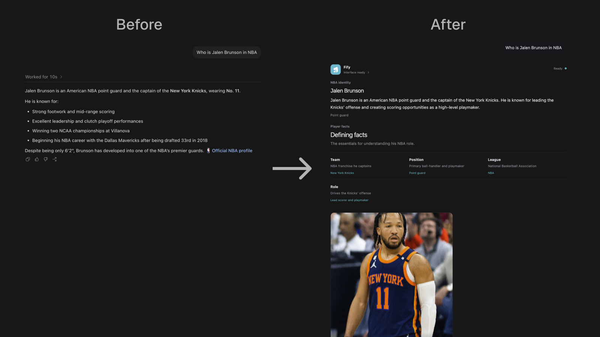

# Fify

**Design the presentation layer of AI responses.**

[](https://github.com/renfei-design/Fify/actions/workflows/ci.yml)
[](LICENSE)



AI can produce a correct answer and still communicate it poorly. Most AI responses arrive as long, linear blocks of plain text—even when the information is really a comparison, timeline, process, decision, plan, or interactive task.

Fify is an open-source presentation layer for AI responses. It turns grounded answers into well-designed information interfaces that are easier to understand, more digestible, and more actionable.

Instead of asking a model to generate application code, Fify asks it to describe the meaning and structure of the response. Fify validates that semantic plan, compiles it to A2UI, and renders it through trusted, application-owned components. The complete plain-language answer remains available as an authoritative fallback.

## The problem

Plain text is a useful universal fallback, but it is often a poor default interface for complex information.

When every response is rendered as prose, people have to do the presentation work themselves:

- find the hierarchy hidden inside paragraphs;
- compare options scattered across the answer;
- reconstruct sequences, dependencies, and chronology;
- separate evidence from conclusions;
- remember decisions and next steps;
- translate instructions into something they can actually work through.

Longer and more capable AI answers can make this problem worse. More information does not automatically create more understanding.

The missing layer is information design: choosing the right structure, visual hierarchy, interaction, and level of disclosure for the job the user is trying to accomplish.

## The Fify idea

Fify separates **what the answer says** from **how the answer should be presented**.


The answer stays authoritative. Fify designs its presentation.

| When the user needs to… | Plain text usually provides…          | Fify can present…                                      |
| ----------------------- | ------------------------------------- | ------------------------------------------------------ |
| Compare alternatives    | Paragraphs and scattered tradeoffs    | A structured comparison or decision view               |
| Understand a sequence   | A numbered explanation                | Steps, a timeline, or a process view                   |
| Track work              | Instructions embedded in prose        | A checklist, progress view, or working plan            |
| Explore evidence        | Links and facts mixed into the answer | Metrics, tables, findings, and source-aware details    |
| Make a choice           | A recommendation plus caveats         | Options, criteria, constraints, and a clear conclusion |
| Continue the task       | A suggested follow-up sentence        | Trusted inputs and prompt actions with preserved state |

Fify can express direct answers, explainers, profiles, procedures, comparisons, schedules, briefings, plans, decision tools, and workflows without turning every response into the same dashboard.

## What Fify is—and is not

Fify is:

- a presentation and interaction layer for grounded AI answers;
- a semantic UI compiler with a finite, trusted component vocabulary;
- a way for product teams to keep control of design, accessibility, and behavior;
- an A2UI-based protocol boundary that can support multiple hosts and renderers;
- an open project where designers and developers can evolve the language of AI responses together.

Fify is not:

- a replacement for the model, agent, retrieval system, or factual answer;
- a prompt-to-React or prompt-to-HTML code generator;
- permission for models to execute arbitrary components or actions;
- a design-system replacement;
- a claim that every answer needs an interface—short answers should stay short.

## Why this architecture matters

### Better comprehension

The presentation follows the information shape. Comparisons look comparable, chronology reads chronologically, and tasks can become workable state instead of remaining instructions in a paragraph.

### Design-system control

The model selects semantic structures, not pixels or implementation code. The host application owns components, tokens, responsive behavior, accessibility, and brand expression.

### A safer trust boundary

Model output is untrusted data. Fify validates schemas, graph integrity, catalog membership, references, actions, media, and representation compatibility before committing a surface.

### Progressive responses

Parent-first semantic graphs compile into an A2UI message stream, allowing the trusted interface shell and meaningful structure to appear while later content is still arriving.

### Honest failure behavior

Fify distinguishes generated, deterministic, preview, and unavailable states. It preserves the complete text answer when interface generation, validation, mounting, or reconnection fails.

## Who Fify is for

### Designers

Use Fify to define how AI should communicate hierarchy, evidence, comparison, chronology, uncertainty, progress, and action—not just how a chat bubble should look. Contributions can shape component semantics, response blueprints, interaction patterns, accessibility rules, and comprehension evaluations.

### Developers and agent builders

Add adaptive information UI without executing model-authored frontend code. Integrate a validated semantic contract, provide trusted data and capabilities, and render through components your application already controls.

### Researchers and toolmakers

Experiment with response-medium evaluation: whether an interface improves comprehension, reduces effort, preserves grounding, and helps people complete a task—not merely whether the output looks polished.

## Try Fify

Requirements:

- Node.js 22 or newer;
- pnpm 11 or newer;
- an OpenAI API key only for live model generation in the browser;
- a compatible Codex installation only for the local plugin path.

### Option 1: browser application

```bash
git clone https://github.com/renfei-design/Fify.git
cd Fify
corepack enable
pnpm install
pnpm web
```

Open the local URL printed by Next.js. Choose **Settings** at the bottom of the left navigation, save your OpenAI API key, and ask normally. The port is selected at startup and may change when the default is already in use.

The browser key is stored in that tab's session storage and forwarded only with generation requests. It is not written into conversation history or committed to the repository. A server operator can configure `OPENAI_API_KEY` instead.

### Option 2: Codex integration

From the cloned repository:

```bash
corepack enable
pnpm install
pnpm codex:install
```

The installer now refuses to replace the active plugin while the ChatGPT/Codex desktop MCP host is running. Fully quit the app with Command-Q, run the install from Terminal, then reopen it. Opening a new task alone does not restart the long-lived MCP host. Then verify the real host boundary:

```bash
pnpm codex:verify-host
```

The preflight rejects a desktop MCP host that predates the installed plugin and verifies the exact six-section, three-image comparison shape in a separate fresh Codex process. It is necessary but not final acceptance: tag `@Fify` in a brand-new desktop task and require the native widget to mount. Resuming a task created before installation keeps its old tool snapshot. Ordinary untagged requests remain standard Codex answers.

The local plugin works without an end-user provider key because Codex supplies the grounded answer and the bundled server has a trusted deterministic composer. Named real-person profiles resolve an attributed portrait through a bounded Wikimedia lookup unless the user requests no image. A service operator may optionally configure a provider key for model-selected composition.

Good prompts to try:

- `@Fify` compare these options by cost, effort, and risk.
- Use Fify to turn this launch plan into a checklist I can work through.
- Show the milestones as an interactive timeline with dependencies.
- Make this research summary an interactive view I can scan and explore.
- Use Fify to help me choose by separating evidence, assumptions, and tradeoffs.

## Use Fify in an application

Fify currently exposes three supported prerelease workspace packages. Registry publication is planned after the APIs stabilize.

| Package       | Purpose                                                                                 |
| ------------- | --------------------------------------------------------------------------------------- |
| `@fify/core`  | Semantic language, grounding policy, provider gateway, validation, and A2UI compilation |
| `@fify/react` | Trusted React renderer factory for application-owned component catalogs                 |
| `@fify/a2ui`  | Portable A2UI message contracts and deterministic surface reducer                       |

Evaluation code remains private release tooling until its API is stable.

### Compile grounded information

```ts
import { createInformationUI } from "@fify/core";

const result = createInformationUI({
  version: "1.0",
  originalRequest: "Compare a focused launch with a broad launch.",
  groundedAnswer:
    "A focused launch validates faster. A broad launch covers more use cases.",
  locale: "en",
  sections: [
    {
      id: "options",
      title: "Launch options",
      body: "Choose based on validation speed and coverage.",
      items: [
        {
          id: "focused",
          label: "Focused",
          value: "Faster validation",
          detail: "Start with one workflow.",
          sourceIds: [],
        },
        {
          id: "broad",
          label: "Broad",
          value: "More coverage",
          detail: "Support more workflows at launch.",
          sourceIds: [],
        },
      ],
      sourceIds: [],
    },
  ],
  sources: [],
  suggestedRefinements: [],
});
```

`result.messages` is a validated, ordered A2UI message sequence that a host can reduce or deliver over its own transport. `result.fallbackText` is the authoritative text fallback.

### Generate an answer and layout with OpenAI

Use the optional OpenAI adapter from server-side code only. It makes two structured-output calls: one creates a validated information envelope from the prompt, and the second selects a catalog-constrained composition. This adapter does not retrieve current information or produce citations.

```ts
import { generateOpenAIInformationUI } from "@fify/core/openai";

const result = await generateOpenAIInformationUI({
  apiKey: process.env.OPENAI_API_KEY!,
  prompt: "Compare two launch strategies.",
});
```

Applications that need current or private facts should ground those facts through a trusted host adapter before rendering them. Never expose a provider key in browser-delivered code.

Run the complete supported example:

```bash
pnpm --filter @fify/example-minimal-react dev
```

Open the local URL printed by Next.js. See the [minimal React starter](examples/minimal-react) for the full core → A2UI → React flow.

## Trust boundary

Fify deliberately keeps model judgment inside a constrained semantic layer:

- The model never writes HTML, React, CSS, JavaScript, network calls, or arbitrary event handlers.
- Unknown components, catalogs, references, actions, and unsafe media fail closed.
- The host owns factual data access, authentication, authorization, and consequential actions.
- Model-authored facts can be restricted to exact host-supplied information and sources.
- Current or private claims require a trusted evidence adapter.
- Interaction state lives in the trusted renderer, not in generated layout code.
- Credentials, local run data, generated bundles, and databases are ignored by version control.
- The complete ordinary answer remains available when the interface cannot render.

Read [the architecture](docs/architecture.md) for the full semantic graph, validation, streaming, reconnection, and grounding model.

## Repository structure

```text
apps/demo          Browser chat and ChatGPT launch pages
apps/mcp-app       MCP Apps server and portable host widget
packages/core      Semantic compiler, grounding, and provider boundary
packages/react     Trusted React renderer factory
packages/a2ui      Portable protocol contracts and surface state
packages/evals     Private deterministic evaluation tooling
examples           Minimal supported application integration
plugins/fify       Codex plugin manifest, skill, evals, and public assets
docs               Architecture, quality, security, and contributor guides
```

## Project status and limitations

Fify is an early public prerelease. The core idea and trust boundary are implemented, but APIs may change before the first stable release.

Current limitations include:

- public packages are verified as tarballs but are not yet published to a registry;
- the included run store is process-local rather than shared production infrastructure;
- React is the supported application renderer today;
- the browser evidence path demonstrates selected public adapters rather than general retrieval;
- consequential real-world mutations are intentionally outside the current public core;
- live comprehension measurement still requires broader user evaluation.

See [quality](docs/quality.md) for the current release gates and [package boundaries](docs/package-boundaries.md) for stability commitments.

## Contributing

The project benefits from both design and engineering contributions. Useful areas include:

- new semantic information patterns that solve a demonstrated comprehension problem;
- trusted renderer components and additional framework adapters;
- accessibility, keyboard, screen-reader, responsive, and reduced-motion improvements;
- comprehension and task-completion evaluation cases;
- grounding, validation, protocol, and reconnect reliability;
- examples showing how products can adapt Fify to their own design systems;
- documentation that makes the two adoption paths easier to understand.

Start with [CONTRIBUTING.md](CONTRIBUTING.md). For security issues, follow the private process in [SECURITY.md](SECURITY.md).

## Verify the repository

```bash
pnpm check
pnpm test:e2e
```

`pnpm check` covers public-tree safety, types, unit tests, deterministic semantic evaluations, production builds, plugin validation, and isolated consumption of the three packed public packages. Browser tests cover the supported adoption paths, settings-based key management, responsive behavior, and progressive generation.

## Documentation

- [Getting started](docs/getting-started.md)
- [Architecture](docs/architecture.md)
- [Framework guide](docs/framework.md)
- [Package boundaries](docs/package-boundaries.md)
- [ChatGPT and Codex integration](docs/chatgpt-plugin.md)
- [Quality system](docs/quality.md)
- [Release process](docs/releasing.md)
- [Contributing](CONTRIBUTING.md)
- [Security](SECURITY.md)
- [Support](SUPPORT.md)

## Open-source acknowledgements

Fify is built on—and has learned from—a broad open-source ecosystem. We are grateful to the maintainers and contributors behind these projects:

- **Protocols and host integration:** [A2UI](https://a2ui.org/) for declarative, catalog-constrained interface messages; [Model Context Protocol](https://modelcontextprotocol.io/), its [TypeScript SDK](https://github.com/modelcontextprotocol/typescript-sdk), and [MCP Apps](https://modelcontextprotocol.io/extensions/apps/overview) for portable tools and embedded host interfaces.
- **Runtime and interface:** [Node.js](https://nodejs.org/), [React](https://react.dev/), [Next.js](https://nextjs.org/), [shadcn/ui](https://ui.shadcn.com/), [Tailwind CSS](https://tailwindcss.com/), [PostCSS](https://postcss.org/), [Zod](https://zod.dev/), [Lucide](https://lucide.dev/), [Class Variance Authority](https://cva.style/), [clsx](https://github.com/lukeed/clsx), and [tailwind-merge](https://github.com/dcastil/tailwind-merge).
- **Engineering, documentation, and quality:** [TypeScript](https://www.typescriptlang.org/) and [DefinitelyTyped](https://github.com/DefinitelyTyped/DefinitelyTyped), [pnpm](https://pnpm.io/), [Turborepo](https://github.com/vercel/turborepo), [Vitest](https://vitest.dev/), [Playwright](https://playwright.dev/), [axe-core](https://github.com/dequelabs/axe-core), [Prettier](https://prettier.io/), [esbuild](https://esbuild.github.io/), [Sharp](https://sharp.pixelplumbing.com/), and [Mermaid](https://mermaid.js.org/). Continuous integration uses [GitHub Actions](https://github.com/features/actions) with [checkout](https://github.com/actions/checkout), [setup-node](https://github.com/actions/setup-node), and [pnpm/action-setup](https://github.com/pnpm/action-setup).
- **Trusted public data and media:** [Wikipedia](https://www.wikipedia.org/), [Wikimedia Commons](https://commons.wikimedia.org/), [Openverse](https://openverse.org/), and [Open-Meteo](https://open-meteo.com/). Fify preserves source and license attribution where returned content requires it.
- **Related work and architectural influences:** [json-render](https://github.com/vercel-labs/json-render), [AI SDK generative UI](https://ai-sdk.dev/docs/ai-sdk-ui/generative-user-interfaces), and [AG-UI](https://docs.ag-ui.com/). These projects informed Fify's design exploration; they are not presented as Fify runtime dependencies.

The package manifests and [pnpm lockfile](pnpm-lock.yaml) are the authoritative record of direct and transitive software dependencies and their exact versions. Each upstream project retains its own license and trademarks; Fify's Apache 2.0 license applies to Fify's original code.

## License

Fify is available under the [Apache License 2.0](LICENSE).
