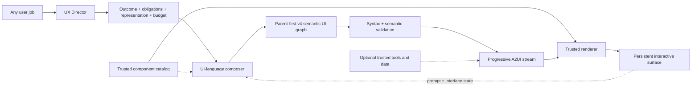

# UI-native agent architecture

Fify treats interface as the agent's native response language. The default path has seven boundaries:

1. **User job** — the outcome the person is trying to reach, not only the topic they named.
2. **UX Director** — identifies the outcome, attention mode, content obligations, disclosure, and budget, then selects the representation route.
3. **UI-language composer** — fulfills only the visible obligations using type-discriminated model nodes.
4. **Structured Output** — constrains both stages to versioned schemas.
5. **Semantic validation** — checks graph integrity and representation compatibility before final commit.
6. **A2UI translation** — turns normalized trusted nodes into progressive protocol messages.
7. **Trusted renderer** — product-owned shadcn/ui components provide code, accessibility, state, and visual quality.



## The UI language

### Content judgment before components

The first-stage output is a `UXDecisionBrief`. It decides what must be understood before deciding how many visible components to use. Exactly one content obligation is primary; other obligations are supporting only when they materially improve comprehension or action, otherwise they are deferred. An obligation can carry an exact `itemCount`, turning “three ideas,” “top 10,” and similar wording into a validated content contract. Attention mode (`glance`, `read`, `explore`, or `work`) clamps the model-authored node, repeated-item, and copy budgets. Trusted code can reduce these budgets but never silently reduce explicit cardinality.

Trusted subtraction is request-grounded, not merely numeric. Optional controls, criteria, assumptions, explanations, preparation, routes, and next steps are deferred unless the prompt asks for them. Compound routes use a smaller sufficiency ceiling than workflow tools. An interactive tool reserves its budget for a complete input → action → result loop before explanatory extras, and a grouping `Card` with children is treated as a container rather than a separate semantic answer.

Two grounding rules prevent useful information from being subtracted mechanically. A profile promotes one identity image to supporting content unless the user explicitly asks for no image or portrait. A request to transform referenced-but-missing material—such as “turn these notes into actions”—is upgraded from read-only to edit interaction so the response can collect the source instead of inventing it. Editable budgets reserve one additional node beyond visible obligations for continuation. If composition still omits the collection loop, trusted policy supplies a compact source input and prompt action before final subtraction.

The brief nests a `RepresentationPlan`, preserving the semantic routing system while preventing slots from automatically becoming visible boxes. It describes content obligations rather than writing a second version of the factual answer; the composer remains the sole model stage that authors final response copy.

The planner classifies content into thirteen information shapes: narrative, facts, record, metrics, trend, hierarchy, sequence, chronology, comparison, tasks/progress, choice/input, spatial, and media/artifact. Those shapes describe meaning independently from components.

Twelve canonical response blueprints cover direct answers, profiles, explainers, procedures, decisions, schedules, briefings, analysis, monitoring, exploration, tools, and workflows. `blueprint` mode selects exactly one. `hybrid` mode selects exactly two when a compound job genuinely needs both. `open` mode selects `open-composition` for novel, expressive, ambiguous, or metaphorical requests. The open route has a larger novelty budget but still declares semantic slots and uses trusted components.

Eight layout topologies provide spatial grammar without freezing a DOM template: editorial stack, focal split, responsive grid, horizontal rail, timeline spine, spatial map, form/result, and open canvas. Each blueprint defines compatible topologies, required roles, allowed information shapes, forbidden components, and a content-size range.

The representation and decision brief are placed in the A2UI data model by trusted code; the composer cannot silently rewrite them.

The agent returns a flat graph so it can stream safely, while `children` references create a real hierarchy:

```text
Structure  Page · Stack · Row · Grid · Rail · Card
Hierarchy  Hero · SectionHeader · Text · FactList · Badge · Divider · Spacer
Media      Image
Evidence   Metric · Chart · Donut · Table · Progress
Narrative  Timeline · Steps · Quote · Callout · Visual
Decisions  Comparison · ChoiceGroup · Tabs
Tasks      Checklist · Input · Button · Calendar · MapPanel · CodeBlock
```

The model owns composition rather than merely filling sections. It declares semantic importance, grouping relationships, media roles, and interaction intent. It does not choose palettes, visual personalities, tones, variants, spans, or decorative icons. The renderer interprets the complete representation plan through a product-owned visual constitution.

Composition follows information semantics rather than visual convenience: prose becomes `Text`; unordered facts become `FactList`; named attributes become `Table`; chronology becomes `Timeline`; order-dependent instructions become `Steps`; and only genuinely completable user tasks become `Checklist`. This prevents controls such as checkboxes from being used as decorative bullets.

Compatibility is strict at the route boundary but not needlessly literal inside it. A component may express any shape in the selected blueprint's trusted vocabulary even when the director omitted that adjacent shape from its narrow authored list. This lets an explainer use a comparison example and a briefing use a short sequence without opening the graph to arbitrary components. Media remains stricter: an `Image` must occupy a declared `media-artifact` slot.

Interaction intent is equally authoritative. If the validated representation is read-only, accidental `ChoiceGroup` or `Tabs` nodes become static `FactList` information, selectable comparisons become static comparisons, incidental inputs become text, and prompt buttons are removed. If the representation is interactive, a continuation can remain visible even when the model placed it in an otherwise deferred action slot. At the 24-node graph ceiling, the compiler promotes children and reclaims one nonessential node before adding a required continuation.

The product still owns every executable implementation. The graph contains no HTML, React, CSS, JavaScript, network calls, or arbitrary event handlers. Safe actions are limited to prompt, select, toggle, and none. Domain adapters remain necessary when claims require current or private data.

For media, the same trust boundary applies. The model can request an image by semantic query and specify alt text, caption, and aspect, but any model-authored URL or attribution is discarded. The server first attempts a canonical Wikimedia page image, then falls back to Openverse discovery, and only emits allowlisted HTTPS image hosts with creator, license, provider, and source-page metadata. The unresolved `Image` node renders as a skeleton and is replaced in place when lookup completes; lookup failure degrades to a compact unavailable state without failing the answer.

## Progressive graph protocol

The model emits nodes in parent-first order. This property allows the surface to become meaningful before the full response is complete:

1. `createSurface` opens an empty trusted A2UI surface.
2. Stage one validates a UX decision brief and places both the decision and representation in the A2UI data model.
3. A single primary placeholder avoids prematurely turning every semantic slot into a visible card.
4. The root `Page` and each fully closed discriminated node are normalized and sent through `updateComponents`.
5. Missing child references render as skeletons until their nodes arrive.
6. The complete graph passes graph and representation compatibility validation, then deterministic policy removes deferred and over-budget content while preserving needed ancestors.
7. A final authoritative component set, decision metadata, plan, screen, and suggestions become the commit boundary.

Every provisional stream is attempt-aware. If final semantic validation rejects a decision brief or graph, the route performs at most one semantic regeneration. Before a graph retry, it republishes the trusted representation skeleton at `root`, so nodes from the rejected attempt remain inert and unreachable. Only the final validated graph receives a `complete` frame. On follow-ups, exhausting repair restores the prior validated graph to the same surface instead of committing broken UI. Recovery metadata records direction attempts, composition attempts, semantic repairs, and fallback use.

Rejected semantic attempts retain their provider token usage. Completion telemetry and live evaluation totals therefore include the cost of repair, with rejected-input and rejected-output token subtotals exposed separately.

Live outcome assertions are defined once and imported by both the credentialed generator and a sanitized-report replay tool. Assertion revisions are versioned independently from model output, so an evaluator false negative can be corrected and audited without another expensive generation run. Replay never upgrades a case that lacks a previously validated graph diagnostic.

This adds no latency or tokens to the normal path: a valid response still makes one direction call and one composition call. The extra call is paid only after semantic failure, shares the request deadline, and is capped at one per stage.

The transport is newline-delimited JSON containing status, A2UI, completion, and error frames. Every frame also contains a stable run ID and monotonic sequence. A subscriber may reconnect with its last committed sequence; the runtime replays only later frames, then follows the live run. Detaching a subscriber does not cancel generation. Provider text deltas are never displayed as prose. Chunk boundaries are irrelevant because the decoder buffers incomplete lines and the server extracts only complete JSON values.

## Graph invariants

- The first node is the only `Page`, with ID `root`.
- IDs are globally unique across nodes and repeated items.
- Every child reference resolves and every node is reachable from root.
- Cycles and leaf nodes with children fail closed.
- Item-driven components have sufficient data.
- Structural nodes use no semantic slot; every content node uses a declared slot, and the primary slot is fulfilled.
- A component must support a shape declared by the route. Common sequence/chronology mismatches are normalized without discarding content. In a hybrid route, a component is globally forbidden only when every selected blueprint forbids it; one blueprint cannot erase the other blueprint's required job.
- The committed graph stays within the UX decision's visible-node and repeated-item bounds; excess supporting content is removed rather than exposed as an error.
- Explicit collection cardinality is exact after policy pruning; prose compression and undersized or oversized collections trigger semantic repair.
- A stateful `Input`, `ChoiceGroup`, `Tabs`, or selectable `Comparison` cannot validate without one prompt `Button`; editable missing-source responses receive a trusted input and continuation when the composer omits them.
- Component diversity is never required for its own sake; an atomic answer may be `Page → Text`.
- Unknown catalogs, components, actions, or properties fail closed.
- The model-facing schema cannot author presentation tokens; semantic intent is compiled into product-owned styling.
- Final graph validation is authoritative even though individual nodes render optimistically.
- A semantically rejected attempt is never a commit: its root is replaced before retry, and failed follow-ups restore the previous validated graph.

These rules are deliberately stricter than JSON Schema alone. They prevent the most common failure modes of generative UI: flat card stacks, disconnected output, invalid references, arbitrary code, and visual repetition disguised as flexibility.

## Interaction and continuity

Inputs, selections, and toggles live in the trusted renderer. A prompt action sends the declared follow-up plus the current interface state back to the agent. The validated current graph, recent requests, and persistent surface ID accompany follow-ups, so the agent can preserve compatible semantic IDs or decisively replace the composition when the user's job changes.

This is a UI conversation: each turn may transform the same surface instead of appending another message.

The browser client persists only schema-validated conversation turns: the request envelope, partial or committed A2UI surface, validated experience, last sequence, and local interaction state. It resumes unfinished runs after hydration and ignores duplicated or foreign frames. A bounded reconnect loop uses the same run ID; an explicit expired-checkpoint response causes a clean new run with a reset provisional surface. Browser-entered credentials are stored separately in session storage and are never serialized with conversation history.

The included run store is deliberately a bounded process-local adapter: 32 recent or concurrent runs, explicit capacity rejection, a ten-minute finished-run lifetime, ordered replay, and fan-out to live subscribers. It proves the protocol and local failure behavior but does not claim cross-process durability. A production deployment must provide shared persistence and coordinated execution without changing the run ID and sequence contract.

## Relation to public protocols

The architecture separates two concerns that public generative-UI projects also keep distinct:

- **UI description:** A2UI uses declarative, catalog-constrained component descriptions so agents choose composition without executing arbitrary code.
- **Agent transport:** Fify currently needs its checkpointed NDJSON lifecycle. AG-UI becomes relevant when tool calls, long-running agent orchestration, and bidirectional shared state become core.

Fify compiles its simpler model contract into A2UI rather than asking the model to author protocol boilerplate. This keeps prompts compact, allows semantic validation before commit, and leaves room for other renderer adapters.

## Domain extensions

The UI language is the default response medium for ordinary knowledge and planning jobs. Add a host-owned adapter when an experience needs specialized components, factual data binding, permissions, or consequential actions. The browser's Open-Meteo adapter is a small example of trusted structured evidence without making a domain-specific package part of the framework.

## Deferred—not core

- Shared cross-process run persistence and coordinated workers.
- Tool lifecycle events through AG-UI or an equivalent transport.
- Native iOS, Android, Flutter, and Compose renderers for the same catalog.
- Arbitrary runtime code generation, which remains intentionally excluded.
